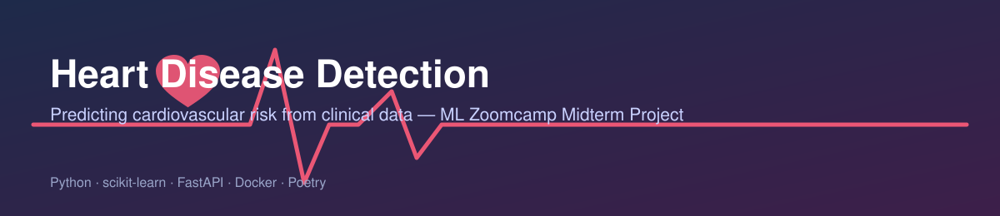

<p align="center">
  
</p>

<p align="center">
  
  
  
  
  
  
</p>

# Heart Disease Detection

A machine learning project that predicts whether a patient is likely to have heart
disease from clinical measurements (age, cholesterol, resting blood pressure, and
more), served as a containerized FastAPI application. Built as the midterm project
for [ML Zoomcamp](https://github.com/DataTalksClub/machine-learning-zoomcamp).

## Table of Contents
- [Context](#context)
- [Dataset](#dataset)
- [Project Structure](#project-structure)
- [Approach & Results](#approach--results)
- [How to Run the Project](#how-to-run-the-project)
- [Making Predictions](#making-predictions)
- [Future Improvements](#future-improvements)
- [Author](#author)

## Context

Cardiovascular disease (CVD) is the leading cause of death worldwide. This project
uses patient-level clinical features — age, cholesterol, resting blood pressure,
maximum heart rate, and others — to predict whether a patient has heart disease.
Several models were trained and tuned, and the best-performing one was selected and
deployed behind a REST API to support early, data-driven diagnosis.

## Dataset

Public dataset: [Heart Failure Prediction Dataset (Kaggle)](https://www.kaggle.com/datasets/fedesoriano/heart-failure-prediction)

> **To reproduce:** download the CSV from the link above, then load it in the
> notebook as shown (`pd.read_csv(...)`) to reproduce the training pipeline.

## Project Structure

```
Midterm-project-ML-Zoomcamp/
├── banner.svg
├── notebook.ipynb          # EDA, model training, and comparison
├── train.py                # Final training script (fits and saves the model)
├── serve.py                # FastAPI app: loads the model and exposes /predict
├── Dockerfile
├── pyproject.toml          # Poetry-managed dependencies
├── poetry.lock
└── README.md
```
*(adjust file names above to match your actual repo layout)*

## Approach & Results

- **Models compared:** *[list what you actually tried, e.g., Logistic Regression, Decision Tree, Random Forest — fill in]*
- **Tuning:** *[e.g., grid search over `n_estimators`, `max_depth` — fill in]*
- **Best model:** Random Forest
- **Performance on the validation set:**

  | Metric | Score |
  |---|---|
  | Accuracy | `0.913` |
  | Precision | `0.881` |
  | Recall (sensitivity) | `0.981` |
  | Specificity | `0.820` |
  | F1 score | `0.929` |
  | ROC-AUC | `0.901` |

  **Confusion matrix:**

  |  | Predicted: No disease | Predicted: Disease |
  |---|---|---|
  | **Actual: No disease** | 64 (TN) | 14 (FP) |
  | **Actual: Disease** | 2 (FN) | 104 (TP) |

  The model misses only 2 out of 106 true heart-disease cases (98.1% recall), at
  the cost of 14 false positives. For a diagnostic-support tool this is a
  favorable trade-off — flagging a healthy patient for a closer look is far
  less costly than missing a real case.

## How to Run the Project

**Prerequisites:** [Docker Desktop](https://www.docker.com/products/docker-desktop/) running, and this repo downloaded or cloned locally.

1. **Review the notebook first** (`notebook.ipynb`) to understand the EDA and
   modeling approach before running the containerized service.
2. **Open the project folder** in VS Code (or your editor of choice) and open a
   terminal in the project directory.
3. **Install dependencies with Poetry** (only needed if you're modifying the
   project — running the prebuilt container does not require this step):
   ```bash
   # install Poetry (Windows PowerShell)
   (Invoke-WebRequest -Uri https://install.python-poetry.org -UseBasicParsing).Content | py -

   poetry init
   poetry add fastapi scikit-learn uvicorn requests
   poetry lock   # run this after every change to pyproject.toml
   ```
4. **Build the Docker image:**
   ```bash
   docker pull python:3.11-slim
   docker build -t heart-disease-app .
   ```
5. **Run the container:**
   ```bash
   docker run -p 8000:8000 heart-disease-app
   ```
6. **Open the interactive API docs:** go to
   [`http://localhost:8000/docs`](http://localhost:8000/docs) in your browser,
   expand `/predict`, click **Try it out**, and submit a patient record.

## Making Predictions

The API returns two values:
- `probability` — the model's estimated probability that the patient has heart disease
- `heart_disease` — `true` if `probability >= 0.5`, otherwise `false`

**Example (curl — macOS/Linux):**
```bash
curl -X POST http://localhost:8000/predict \
  -H "Content-Type: application/json" \
  -d '{
    "age": 65, "sex": "m", "chestpaintype": "asy", "restingbp": 160,
    "cholesterol": 0, "fastingbs": 1, "restingecg": "st", "maxhr": 122,
    "exerciseangina": "n", "oldpeak": 1.2, "st_slope": "flat"
  }'
```

**Example (PowerShell — Windows):**
```powershell
$patient = @{
  age = 65; sex = "m"; chestpaintype = "asy"; restingbp = 160
  cholesterol = 0; fastingbs = 1; restingecg = "st"; maxhr = 122
  exerciseangina = "n"; oldpeak = 1.2; st_slope = "flat"
}
$response = Invoke-RestMethod -Uri http://localhost:8000/predict -Method POST `
  -Body ($patient | ConvertTo-Json) -ContentType "application/json"
$response
```

Or run predictions directly inside the running container:
```bash
docker exec -it <container_name> python3 /myapp/serve.py
```

## Future Improvements

- Add automated tests for the FastAPI endpoints
- Track experiments with MLflow instead of manual notebook comparison
- Deploy the container to a cloud host (Render / Fly.io / AWS) for a live public demo link
- Add SHAP-based feature importance to explain individual predictions

## Author

**Manel Nahdi** — Data Analyst 
[GitHub](https://github.com/manelnh) · [LinkedIn].(https://www.linkedin.com/in/manel-nahdi-23ab31354/)

---
*This project uses a public dataset for educational purposes and is not a certified medical diagnostic tool.*
